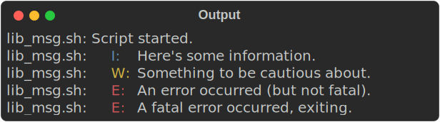

# lib_msg.sh - Shell Message Formatting Library

`lib_msg.sh` is a POSIX-compliant shell library for formatting messages, detecting TTY, wrapping text to terminal width, and displaying colored output.

## Features

-   Standardized message prefixes for information (`I:`), errors (`E:`), warnings (`W:`), and general messages.
-   Functions for messages with and without trailing newlines (e.g., `msg` vs `msgn`).
-   Automatic TTY detection for stdout and stderr.
-   Text wrapping based on terminal width (via `COLUMNS` environment variable) if outputting to a TTY.
-   ANSI color support for messages if outputting to a TTY.
-   `die` function to print an error message and exit with a specified code (or return if sourced).
-   Dynamic terminal width detection (checks width before each message display).
-   Public API for terminal state, text styling, and advanced formatting.

## Usage

<p align=center>
    
    <em>To get this <b>beautiful</b> output:</em>
</p>

1.  **Source the Library:**
    To use `lib_msg.sh` in your shell script, source it at the beginning:
    
    ```sh
    #!/bin/sh
    
    # Adjust path to lib_msg.sh as necessary
    # shellcheck source=./lib_msg.sh
    . "./lib_msg.sh"
    
    # Your script logic here
    msg     "Script started."
    info    "Here's some information."
    warn    "Something to be cautious about."
    err     "An error occurred (but not fatal)."
    die  1  "A fatal error occurred, exiting."
    ```


2.  **Set `SCRIPT_NAME` (Optional but Recommended):**
    The library uses the `SCRIPT_NAME` environment variable for message prefixes. If not set, it defaults to `lib_msg.sh`. It's good practice to set this in your main script:

    ```sh
    SCRIPT_NAME="my_script.sh"
    # Or (Won't work when target script is sourced)
    # SCRIPT_NAME="${0##*/}"
    ```

### Available Functions

#### Standard Output (stdout)

-   `msg "message"`: Prints a general message with a prefix and newline.
-   `msgn "message"`: Prints a general message with a prefix but no trailing newline.
-   `info "message"`: Prints an information message with a blue "I: " prefix and newline.
-   `infon "message"`: Prints an information message with a blue "I: " prefix but no trailing newline.

#### Error Output (stderr)

-   `err "message"`: Prints an error message with a red "E: " prefix and newline.
-   `errn "message"`: Prints an error message with a red "E: " prefix but no trailing newline.
-   `warn "message"`: Prints a warning message with a yellow "W: " prefix and newline.
-   `warnn "message"`: Prints a warning message with a yellow "W: " prefix but no trailing newline.
-   `die <exit_code> "message"`: Prints an error message with a red "E: " prefix, then exits the script with `<exit_code>`. If the function is called from a sourced script, it returns with the error code instead of exiting.

## Public API

The library now provides a comprehensive public API that gives you access to all its core capabilities.

### Configuration

You can configure the library behavior using these environment variables:

- `SCRIPT_NAME`: Sets the prefix for all messages (default: "lib_msg.sh")
- `LIB_MSG_COLOR_MODE`: Controls color output with values:
  - `auto`: Enable colors if outputting to a TTY (default)
  - `on`: Enable colors regardless of TTY status (still respects NO_COLOR)
  - `off`: Disable colors completely
  - `force_on`: Enable colors regardless of TTY status or NO_COLOR
- `NO_COLOR`: Standard environment variable that disables colors when set (unless LIB_MSG_COLOR_MODE=force_on)

### TTY and Terminal Functions

- `lib_msg_stdout_is_tty`: Returns "true" or "false" string indicating if stdout is a TTY
- `lib_msg_stderr_is_tty`: Returns "true" or "false" string indicating if stderr is a TTY
- `lib_msg_get_terminal_width`: Returns the current terminal width (0 if not a TTY or width unknown)
- `lib_msg_update_terminal_width`: Forces updating terminal width from COLUMNS value

Example:
```sh
if [ "$(lib_msg_stdout_is_tty)" = "true" ]; then
    echo "Running in an interactive terminal"
fi

width=$(lib_msg_get_terminal_width)
echo "Terminal is $width columns wide"
```

### Color Support Functions

- `lib_msg_colors_enabled`: Returns "true" or "false" string indicating if colors are enabled
- `lib_msg_reinit_colors`: Reinitializes color support based on current environment

### Text Styling Functions

The library exports SGR (Select Graphic Rendition) constants for styling:

- Text formatting: `$_LIB_MSG_SGR_RESET`, `$_LIB_MSG_SGR_BOLD`, `$_LIB_MSG_SGR_ITALIC`, `$_LIB_MSG_SGR_UNDERLINE`, etc.
- Foreground colors: `$_LIB_MSG_SGR_FG_RED`, `$_LIB_MSG_SGR_FG_GREEN`, `$_LIB_MSG_SGR_FG_BLUE`, etc.
- Background colors: `$_LIB_MSG_SGR_BG_RED`, `$_LIB_MSG_SGR_BG_GREEN`, `$_LIB_MSG_SGR_BG_BLUE`, etc.
- Bright variants: `$_LIB_MSG_SGR_FG_BRIGHT_GREEN`, `$_LIB_MSG_SGR_BG_BRIGHT_YELLOW`, etc.

Functions for working with styles:

- `lib_msg_build_style_sequence <sgr_codes...>`: Creates an ANSI style sequence from SGR codes
- `lib_msg_apply_style <text> <style>`: Applies a style sequence to text if colors are enabled
- `lib_msg_apply_style_if_tty <text> <style> <use_stderr>`: Applies styling if appropriate stream is a TTY

Example:
```sh
# Create a bold red style
bold_red=$(lib_msg_build_style_sequence "$_LIB_MSG_SGR_BOLD" "$_LIB_MSG_SGR_FG_RED")

# Apply the style to text
styled_text=$(lib_msg_apply_style "Important warning" "$bold_red")
echo "$styled_text"

# Or get a predefined style
highlight_style=$(lib_msg_get_style "highlight")
echo "$(lib_msg_apply_style "Highlighted text" "$highlight_style")"
```

### Text Processing Functions

- `lib_msg_strip_ansi <text>`: Removes ANSI escape sequences from text
- `lib_msg_get_wrapped_text <text> <width>`: Wraps text to specified width (use 0 for terminal width)

Example:
```sh
# Strip ANSI codes
raw_text=$(lib_msg_strip_ansi "$styled_text")

# Wrap text to terminal width
wrapped=$(lib_msg_get_wrapped_text "A long paragraph of text that needs to be wrapped to the appropriate width..." 0)
echo "$wrapped"
```

### Custom Message Output Functions

- `lib_msg_output <message> [prefix] [style] [use_stderr] [no_newline]`: Outputs a message with optional prefix and style
- `lib_msg_output_n <message> [prefix] [style] [use_stderr]`: Same as above but without a trailing newline

Example:
```sh
# Create a custom prefix with styling
success_style=$(lib_msg_get_style "success")
prefix=$(lib_msg_create_prefix "SUCCESS" "$success_style" "")

# Output a message with this prefix
lib_msg_output "Operation completed successfully" "$prefix"
```

### Prompt Functions

- `lib_msg_prompt <prompt_text> [default_value] [style]`: Displays a prompt and returns user input
- `lib_msg_prompt_yn <prompt_text> [default_y_or_n] [style]`: Displays a yes/no prompt and returns "true" or "false"

Example:
```sh
# Simple prompt
name=$(lib_msg_prompt "Enter your name" "User")
echo "Hello, $name!"

# Yes/No prompt
if lib_msg_prompt_yn "Continue with the operation?" "y"; then
    echo "Continuing..."
else
    echo "Operation cancelled."
fi
```

### Convenience Functions

- `lib_msg_get_style <style_name>`: Returns predefined style for common styles (error, warning, info, success, highlight, dim)
- `lib_msg_create_prefix <tag> [tag_style] [bracket_style]`: Creates a formatted prefix like "[TAG] "
- `lib_msg_progress_bar <current> <max> [width] [filled_char] [empty_char]`: Generates a text progress bar

Example:
```sh
# Create a progress bar
for i in 1 2 3 4 5; do
    progress=$(lib_msg_progress_bar "$i" 5)
    printf "\r%s" "$progress"
    sleep 1
done
echo # Final newline
```

## Examples

See the [`examples/public_api_demo.sh`](examples/public_api_demo.sh) script for a comprehensive demonstration of all public API functionality.

## Testing

The library includes a comprehensive test suite using [BATS (Bash Automated Testing System)](https://github.com/bats-core/bats-core).

1.  **Install BATS:**
    If you don't have BATS installed, you can install it using your system's package manager.

    *   **Ubuntu/Debian:**
        ```sh
        sudo apt-get update
        sudo apt-get install bats
        ```
    *   **macOS (using Homebrew):**
        ```sh
        brew install bats-core
        ```
    *   **Other systems:** Refer to the [BATS installation guide](https://bats-core.readthedocs.io/en/stable/installation.html).

2.  **Initialize Required Submodules:**
    The test suite relies on several BATS helper libraries that are included as Git submodules:
    
    ```sh
    git submodule init
    git submodule update
    ```

3.  **Run Tests:**
    Navigate to the root directory of this project (where `lib_msg.sh` and the `test` directory are located) and run:

    ```sh
    bats ./test/
    ```

    This will execute all tests defined in the `./test/` directory, covering all aspects of the library.
    
    For parallel testing (which can significantly speed up test execution), you can use:
    
    ```sh
    bats -T test/ -j $(nproc --ignore 2)
    ```

### Updating BATS Helper Submodules

The BATS helper libraries (`bats-assert`, `bats-support`, `bats-mock`) are included as Git submodules in the `./test/libs/` directory. To update them to their latest tagged versions:

1. **Using the provided script:**
   
   The repository includes an update script that you can run from the project root:

   ```sh
   ./scripts/update_submodules.sh
   ```

   This script:
   - Updates all submodules to the latest commit on their tracked branch
   - For each submodule, checks out the latest semantic version tag
   - Provides instructions for committing the changes

2. **Manual update process (alternative):**

   If you prefer to update manually:
   
   ```sh
   # Update all submodules to the latest commit
   git submodule update --remote --merge
   
   # For each submodule, navigate to its directory and checkout the latest tag
   cd ./test/libs/bats-assert
   git fetch --tags
   git checkout $(git tag -l 'v*' | sort -V | tail -n 1)
   # Repeat for other submodules
   ```

   **Note:** This assumes that the latest desired version is always the highest semantic version tag. Review the tags and release notes for each library if you need a specific version other than the latest.

## How It Works

-   **TTY Detection:** On initialization (`_lib_msg_init_detection`), the library checks if stdout (file descriptor 1) and stderr (file descriptor 2) are connected to a terminal using `[ -t 1 ]` and `[ -t 2 ]`. This can be overridden with the environment variables `LIB_MSG_FORCE_STDOUT_TTY` and `LIB_MSG_FORCE_STDERR_TTY` (useful for testing).
-   **Terminal Width:** If a TTY is detected, it attempts to get the terminal width from the `COLUMNS` environment variable. If `COLUMNS` is not set or invalid, wrapping is disabled. The terminal width is checked dynamically before each message display.
-   **Color Initialization:** If a TTY is detected, ANSI escape codes for various colors and styles are initialized (`_lib_msg_init_colors`). Otherwise, color variables remain empty, effectively disabling colored output.
-   **Wrapping Logic (`_lib_msg_wrap_text`):**
    -   If wrapping is enabled and necessary, text is split into words.
    -   Words are appended to the current line if they fit within the calculated maximum content width (terminal width minus prefix length).
    -   If a word doesn't fit, the current line is finalized, and the word starts a new line.
    -   Internally, lines are delimited using a Record Separator (`_LIB_MSG_RS`) for POSIX compliance, avoiding shell arrays.
    -   Very long words that exceed the maximum content width by themselves are forcibly broken into chunks.
-   **Core Printing Logic (`_print_msg_core`):**
    -   This internal function handles all message printing.
    -   It determines the correct output stream (stdout/stderr).
    -   Applies color using `_lib_msg_colorize` if a color code is provided and the stream is a TTY.
    -   If the stream is a TTY and terminal width is known, it uses `_lib_msg_wrap_text` to wrap the message content. Each wrapped line is then prefixed.
    -   If no TTY or no width, it prints the message with the prefix directly.
    -   Handles whether a final newline should be printed.
-   **Context-Aware Exiting (`die` function):**
    -   Detects whether it's being called from a sourced context or directly executed script using `_lib_msg_is_return_valid()`.
    -   If called in a sourced script/function, uses `return` with the error code to allow the calling script to continue.
    -   If called in a directly executed script, uses `exit` to terminate the entire script.
-   **Public API Functions:**
    -   Provide access to the library's core capabilities like TTY detection, color status, and text formatting.
    -   Allow for custom styling and message formatting beyond the standard functions.
    -   Support interactive prompts and progress indicators.

## Developer Documentation

Additional documents for developers, including future plans and improvement ideas, are available:

-   [Improvement Plan](./docs/IMPROVEMENT_PLAN.md): Detailed analysis of weak points and a proposed action plan.
-   [TODO List](./docs/TODO.md): A list of pending tasks and potential enhancements.
-   [Shell Functions Review](./docs/SHELL_FUNCTIONS_REVIEW.md): Review of pure shell fallback functions.

## Limitations and Known Issues

-   **ANSI in Wrapped Text:** The current text wrapping logic in `_lib_msg_wrap_text` is not fully ANSI-aware. If a message is colored *before* wrapping, the ANSI escape codes contribute to the string length seen by the wrapper. This can lead to lines being wrapped slightly shorter than expected visually. To mitigate this, the library handles ANSI stripping for length calculations using `_lib_msg_strip_ansi` (which intelligently chooses between `sed` and a shell fallback).
-   **Complex Scripts in Prefixes:** Prefixes are currently treated as plain text for length calculation. If prefixes contain ANSI codes, the library handles this correctly by stripping ANSI codes when calculating lengths.
-   **`COLUMNS` Variable:** Relies on the `COLUMNS` environment variable being correctly set and updated for accurate terminal width. Some terminal emulators or environments might not update this reliably.
-   **Word Splitting:** The wrapper splits words based on single spaces. Multiple consecutive spaces in the input text might lead to slightly different spacing in the wrapped output compared to the input, as empty "words" might be processed.

## Performance Considerations

Performance tests reveal significant differences between implementation methods:
-   **External Commands vs. Pure Shell:** Performance testing reveals dramatic differences between the implementations:
    - **ANSI Stripping:** While previously the `sed` implementation was dramatically faster than pure shell, our optimized shell implementation now performs comparably to `sed` (7.86ms vs 7.76ms for 5000 chars)
    - **Newline Conversion/Whitespace Removal:** `tr` command outperforms shell by 14-724x depending on input size
    - **Text Wrapping:** Testing revealed the pure shell implementation actually outperforms the `awk` implementation, which is why we now exclusively use the shell implementation for text wrapping
    
    
-   **Scaling with Input Size:** The performance gap increases exponentially with input size:
    - External command performance remains nearly constant regardless of input size
    - Pure shell implementations scale linearly with input size
    
-   **Memory Usage:** The pure shell fallbacks use more memory for string manipulation compared to the optimized external command implementations. This difference becomes more significant with large amounts of text.

-   **Terminal Width Impact:** Narrower terminals (40 vs 80 columns) increase processing time for larger messages by approximately 35% due to increased wrapping operations.

The library automatically selects the best available implementation based on command availability, which validates the hybrid approach of preferring external commands when available while maintaining shell fallbacks for portability. Having `sed` and `awk` installed ensures you get the best performance without any configuration changes.

For detailed performance test results, see the [Testing Guide](./docs/TESTING.md#performance-test-results).

## License

This project is licensed under the GNU General Public License v3.0.
The full license text is available in [`LICENSE.md`](LICENSE.md).