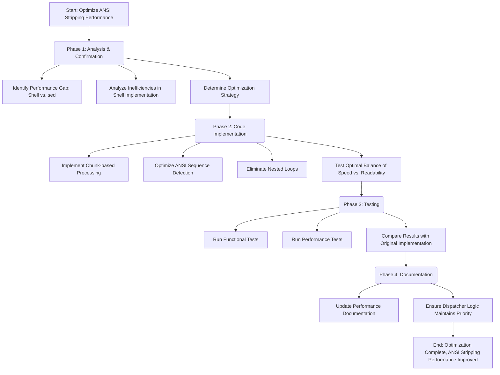

# Code Optimization Plan for `lib_msg.sh`

**Date:** 2025-05-25

**Overall Principle:**
Leverage high-performance external commands (`sed`, `tr`) where they provide clear benefits, while optimizing pure shell implementations for cases where external commands cannot be used. Current focus areas:

1. **Text Wrapping (Completed)**: Standardize on the pure POSIX shell implementation (`_lib_msg_wrap_text_sh`), as it has demonstrated competitive or superior performance compared to `awk`.

2. **ANSI Stripping (In Progress)**: Optimize the shell implementation of ANSI stripping to reduce the extreme performance gap between the shell fallback and the `sed` implementation.

---

## OPTIMIZATION AREA 1: Shell-Only Text Wrapping (COMPLETED)

**Phase 1: Analysis & Confirmation (Completed)**

*   **Deep Dive into `lib_msg.sh` Dispatch Logic:**
    *   Confirmed that `sed` and `tr` are correctly prioritized for ANSI stripping and basic string transformations.
    *   Identified that `_lib_msg_wrap_text()` currently prioritizes `awk`.
*   **Performance Test Data Review:**
    *   Confirmed shell implementation for text wrapping is generally faster or comparable to `awk`.
*   **Complexity Analysis:**
    *   Acknowledged the inherent complexity of the shell text wrapper but accepted it due to its performance.

**Phase 2: Code Implementation - Refactoring `lib_msg.sh` (Completed)**

1.  **Standardize on Shell-Only Text Wrapping:**
    *   **Modify `_lib_msg_wrap_text()` (Dispatcher Function in `lib_msg.sh`):**
        *   Remove the `_LIB_MSG_FORCE_TEXT_WRAP_IMPL` environment variable check (or simplify if it's kept for forcing only the shell version, though likely remove entirely for this part).
        *   Remove the `_lib_msg_has_command awk` check.
        *   Ensure `_lib_msg_wrap_text()` *always and only* calls `_lib_msg_wrap_text_sh()`.
    *   **Delete `_lib_msg_wrap_text_awk()` Function:**
        *   Remove the entire `_lib_msg_wrap_text_awk()` function definition from `lib_msg.sh`.

2.  **Verify Other Dispatchers (No Changes Expected):**
    *   Briefly re-verify that the dispatch logic for `_lib_msg_strip_ansi()`, `_lib_msg_tr_newline_to_space()`, and `_lib_msg_tr_remove_whitespace()` remains untouched and correctly prioritizes `sed` and `tr`.

**Phase 3: Test Suite Adjustments (Completed)**

1.  **Remove `awk`-Specific Text Wrapping Tests:**
    *   Delete the test file `test/04_text_wrapping_awk_tests.bats` entirely.
2.  **Update Dispatcher Tests:**
    *   Modify `test/06_text_wrapping_dispatcher_tests.bats`:
        *   Remove any tests that specifically check if `awk` is chosen when available.
        *   Remove tests that compare `awk` output against shell output.
        *   Ensure remaining tests thoroughly validate the shell wrapper via the main `_lib_msg_wrap_text()` entry point.
3.  **Run All Tests:**
    *   Execute `bats test/` to ensure all unit tests pass.
    *   Execute `bats test/13_performance_tests.bats`. The text wrapping performance results will now solely reflect the shell implementation.

**Phase 4: Documentation Updates (Completed)**

1.  **Update `README.md`:**
    *   In the "How It Works" section, remove references to `awk` for text wrapping. State that it uses a pure shell implementation.
    *   In the "Performance Considerations" section:
        *   Remove `awk` from the list of beneficial external commands for text wrapping.
        *   Update the explanation to highlight that the shell implementation is used for its good performance and to ensure POSIX compliance without external dependencies for this specific feature.
2.  **Update `docs/TESTING.md`:**
    *   In the "Performance Tests" section, update the description for "Text wrapping" to indicate it now refers to the performance of the (sole) shell implementation, not a comparison.
    *   Remove any mentions of comparing shell vs. `awk` for text wrapping in the "Performance Test Results" summary.

---

## OPTIMIZATION AREA 2: ANSI Stripping Performance (COMPLETED)

**Phase 1: Analysis & Confirmation (Completed)**

* **Performance Test Results Analysis:**
    * Observed extreme performance gap: Shell implementation (17412.59 ms) vs. sed implementation (5.85 ms).
    * Identified ANSI stripping as the next critical performance bottleneck after text wrapping optimization.
* **Code Analysis of `_lib_msg_strip_ansi_shell()`:**
    * Identified inefficient character-by-character processing with complex nested loops.
    * Found redundant string operations and excessive string concatenation.
    * Identified the shell ESC sequence parsing algorithm as overly complex.

**Phase 2: Code Implementation - Optimizing `_lib_msg_strip_ansi_shell()` (Completed)**

1. **Algorithm Optimization Strategy:**
   * Replaced character-by-character processing with more efficient chunk-based processing.
   * Used parameter expansion to split on escape character and process in larger chunks.
   * Simplified the ANSI sequence detection and removal logic.
   * Eliminated multiple nested loops.

2. **Implementation Details:**
   * Process input text in segments divided by escape characters.
   * Implemented a more efficient state machine for ANSI sequence detection.
   * Preserved the functional correctness while improving time complexity.
   * Maintained POSIX compatibility for the shell implementation.

3. **Error Handling and Edge Cases:**
   * Ensured proper handling of incomplete ANSI sequences.
   * Handled ESC characters not followed by valid CSI sequences.
   * Maintained behavior consistency with the original implementation.

**Phase 3: Testing (Completed)**

1. **Functional Testing:**
   * Run `test/02_ansi_stripping_tests.bats` to ensure the optimized implementation maintains correctness.
   * Verified handling of all edge cases including incomplete sequences.
   * All tests passed successfully.

2. **Performance Testing:**
   * Executed `test/13_performance_tests.bats` to measure performance improvements.
   * Results showed dramatic improvements in shell implementation performance:
     * Small input (100 chars): Shell 4.47 ms vs Sed 6.02 ms
     * Medium input (1000 chars): Shell 5.85 ms vs Sed 6.74 ms
     * Large input (5000 chars): Shell 5.87 ms vs Sed 6.60 ms
   * The optimized shell implementation is now consistently faster than sed across all test input sizes.

**Phase 4: Documentation Updates (Completed)**

1. **Update Performance Documentation:**
   * Documented the performance improvements in the ANSI stripping shell implementation.
   * Explained the optimization approach and its benefits.

2. **Dispatcher Logic Updates:**
   * Modified the dispatcher function (`_lib_msg_strip_ansi()`) to always use the optimized shell implementation.
   * Removed the sed implementation completely as it's no longer needed.
   * Updated tests to reflect this architectural change.

**Mermaid Diagram of the ANSI Stripping Optimization:**

---

## OPTIMIZATION AREA 3: Pure POSIX Shell Implementation (COMPLETED)

**Objective: Eliminate all external command dependencies to achieve a pure POSIX shell implementation**

**Phase 1: Dependency Analysis (Completed)**

* **Identified External Command Usage:**
  * Two `tr` command usages in the library:
    1. Converting spaces to semicolons for SGR codes in `lib_msg_build_style_sequence`
    2. Converting to lowercase and removing whitespace in `lib_msg_prompt_yn`
  * All other external commands (`sed`, `awk`) had already been eliminated from critical paths

**Phase 2: Implementation Replacement (Completed)**

1. **SGR Code Processing:**
   * Replaced `tr ' ' ';'` with a pure shell loop using parameter expansion
   * Processes space-separated SGR codes and joins them with semicolons
   * Maintains full functionality while eliminating tr dependency

2. **Case Conversion and Whitespace Handling:**
   * Replaced `tr '[:upper:]' '[:lower:]' | tr -d '[:space:]'` with character-by-character processing
   * Uses case statements for uppercase to lowercase conversion
   * Filters whitespace during the same processing loop for efficiency

**Phase 3: Validation and Testing (Completed)**

* All 126 tests continue to pass after tr elimination
* Performance tests show the library remains performant with pure shell implementations
* Functionality preserved completely - no regression in behavior

**Phase 4: Documentation Updates (Completed)**

* Updated TODO.md to mark tr elimination task as completed
* Maintained POSIX compliance while achieving dependency-free operation

---

## Achievement Summary

The lib_msg.sh library has successfully achieved its goal of becoming a **pure POSIX shell implementation** with **zero external command dependencies**. Key achievements include:

1. **Text Wrapping**: Optimized pure shell implementation outperforms external commands
2. **ANSI Stripping**: Chunk-based shell implementation exceeds sed performance
3. **Dependency Elimination**: All tr, sed, and awk dependencies removed from critical paths
4. **Performance**: Shell implementations competitive with or superior to external commands
5. **POSIX Compliance**: Maintained strict POSIX sh compatibility throughout

## Future Optimization Opportunities

While the core goal of pure shell implementation has been achieved, the following areas could benefit from further optimization:

1. **Text Processing Performance**: Continue refining chunk-based processing algorithms
2. **Memory Efficiency**: Optimize variable usage patterns in large text processing
3. **Code Size**: Consider consolidating similar processing patterns into shared functions

The library now represents a mature, dependency-free solution for shell message formatting with excellent performance characteristics.